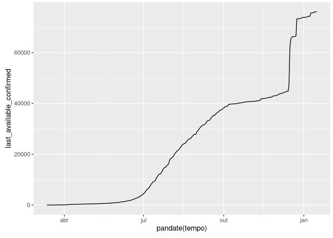
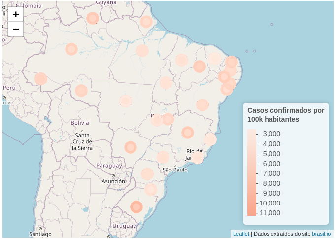

# Gather-Covid

A package to download and pre-process covid-19 Brazil's data from brasil.io.

## Installing

```{r install}
  remotes::install_github("predict-icmc/gather-data")

```

## Loading

```{r setup}
library(gather.covid)
```

## Dependencies 

This package relies on `tidyverse`, `data.table` and `feather` packages.

## Usage

  pegaCorona(tipo = c("caso_full", "cart", "last_cases"), baixar = TRUE, salvar = FALSE))

We can choose one of three arguments in the function `pegaCorona`

For **tipo**, we have:
- caso_full: return a tibble with the cases in all Brazilian cities since day 0;
- cart: return public notary's office's registered deaths
- last_cases: return last balance of cases released, with cities' latitude and longitude

For **salvar**:
 - If `TRUE`, it saves the respective file in the current working dir.
 
For **baixar**:
 - If you already have downloaded the dataset, set it to `TRUE` to not do it again.

## Examples

```{r}
library(tidyverse)

df <- pegaCorona(tipo = "caso_full")

df %>% filter(city == "Curitiba") %>% ggplot() + geom_line(aes(x = date, y = last_available_confirmed))

```


```{r map-plot}
library(leaflet)
df <- pegaCorona(tipo = "last_cases", baixar = F)


values <- df %>%
  filter(place_type == "state") %>%
  select(last_available_confirmed_per_100k_inhabitants) %>%
  pull()
pal <- colorBin("Reds", values)

df %>%
  dplyr::filter(place_type == "state") %>%
  leaflet() %>%
  addTiles(attribution = 'Dados extraídos do site <a href="http://brasil.io/">brasil.io</a>') %>%
  setView(lng = -47.9292, lat = -15.7801, zoom = 4) %>%
  addCircleMarkers(~longitude, ~latitude,
    color = pal(df[["last_available_confirmed_per_100k_inhabitants"]]),
    popup = ~ paste0(
      sep = " ",
      "<b>", state, "<b><br>",
      "<b>Casos confirmados: </b>", last_available_confirmed, "<br>",
      "<b>Casos por 100k habitantes: </b>", last_available_confirmed_per_100k_inhabitants, "<br>",
      "Novos casos: ", new_confirmed, "<br>",
      "Novos óbitos: ", new_deaths, "<br>",
      "Populacão: ", estimated_population_2019, "<br>",
      "Total de Casos Confirmados: ", last_available_confirmed, "<br>",
      "Total de óbitos: ", last_available_deaths, "<br>",
      "Taxa de letalidade: ", last_available_death_rate
    ),
    label = ~state
  ) %>%
  addLegend("bottomright",
    title = "Casos confirmados por<br>100k habitantes",
    pal = pal,
    values = ~last_available_confirmed_per_100k_inhabitants,
    opacity = 0.8, layerId = "colorLegend"
  )
```


## Cartogram with `brazilmaps` library

```{r}
library(brazilmaps)
library(sf)


# definindo o dataframe que contém dados geométricos
shp <- get_brmap("State")
shp_sf <- st_as_sf(shp) %>%
  st_transform(4326)
# unindo os dados de COVID-19 com as geometrias dos estados
shp_sf <- shp_sf %>% dplyr::filter(State %in% df$city_ibge_code)

shp_sf <- left_join(shp_sf, df, by = c("State" = "city_ibge_code"))

colorData <- shp_sf$last_available_confirmed_per_100k_inhabitants

pal <- colorBin("Reds", colorData)

shp_sf %>%
  leaflet() %>%
  addTiles(attribution = 'Dados extraídos do site <a href="http://brasil.io/">brasil.io</a>') %>%
  addPolygons(
    smoothFactor = 0.5,
    fillOpacity = 0.5,
    weight = 0.5,
    fillColor = ~ pal(colorData),
    opacity = 0.8,
    stroke = F,
    highlightOptions = highlightOptions(
      color = "black",
      weight = 2,
      bringToFront = TRUE
    ),
    popup = ~ paste0(
      sep = " ",
      "<b>", nome, "<b><br>",
      "<b>Casos confirmados: </b>", last_available_confirmed, "<br>",
      "<b>Casos por 100k habitantes: </b>", last_available_confirmed_per_100k_inhabitants, "<br>",
      "Novos casos: ", new_confirmed, "<br>",
      "Novos óbitos: ", new_deaths, "<br>",
      "Populacão: ", estimated_population_2019, "<br>",
      "Total de Casos Confirmados: ", last_available_confirmed, "<br>",
      "Total de óbitos: ", last_available_deaths, "<br>",
      "Taxa de letalidade: ", last_available_death_rate
    ),
    label = ~nome
  ) %>%
  addLegend("bottomright",
    title = "Confirmados / 100 mil",
    pal = pal,
    values = ~last_available_confirmed_per_100k_inhabitants,
    opacity = 0.8
  )
```

